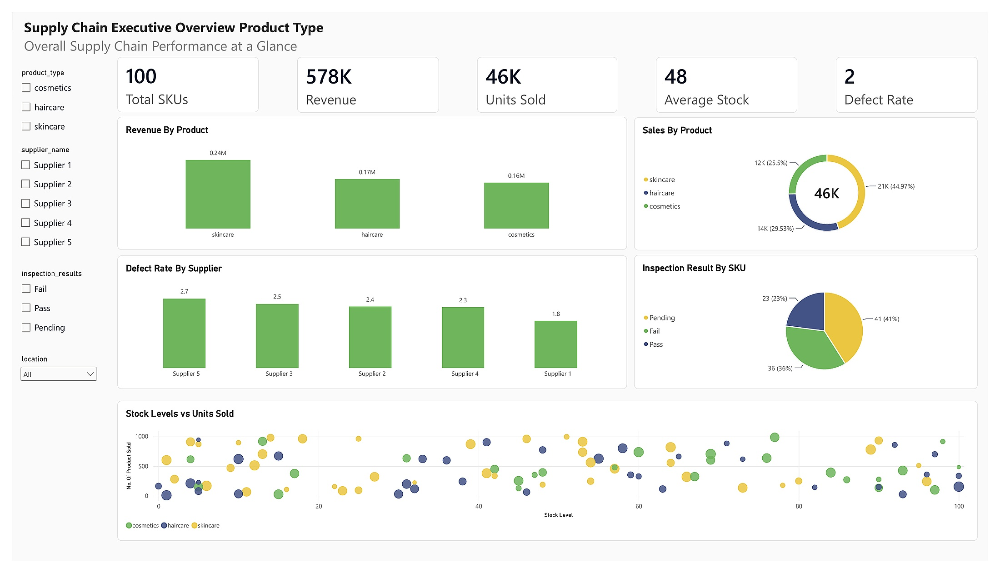
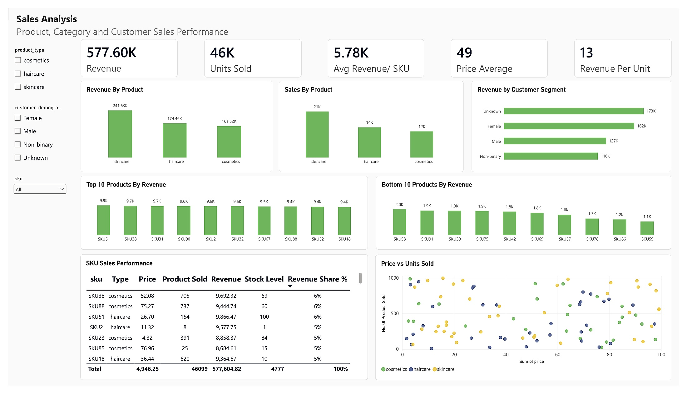
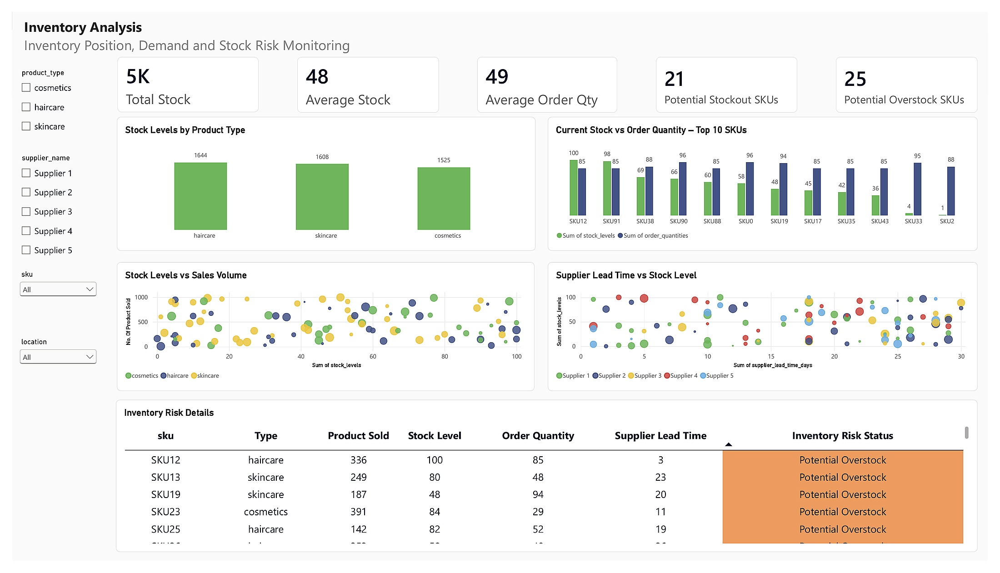
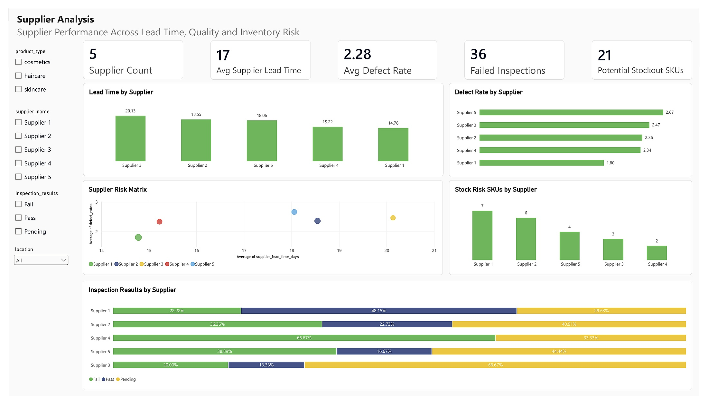
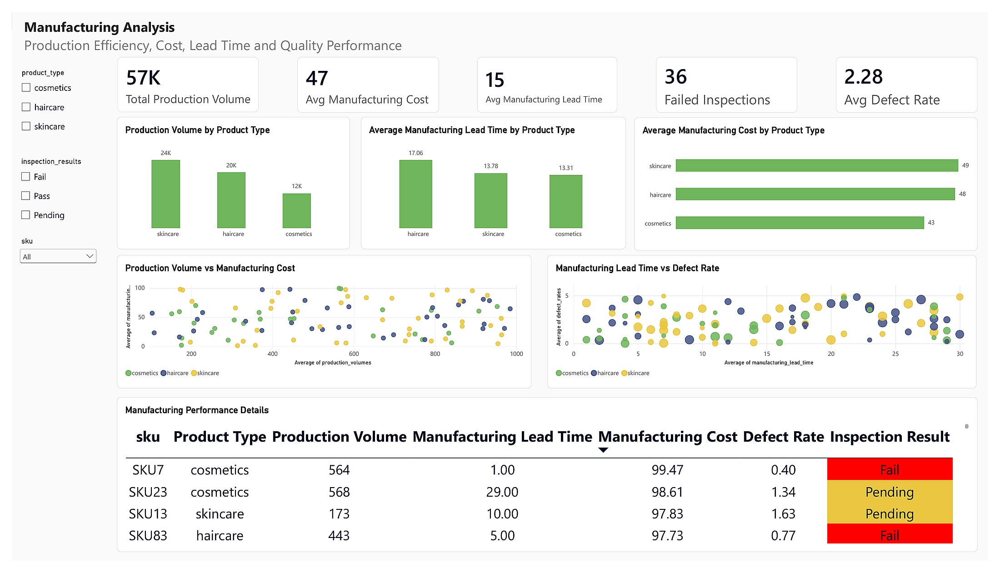
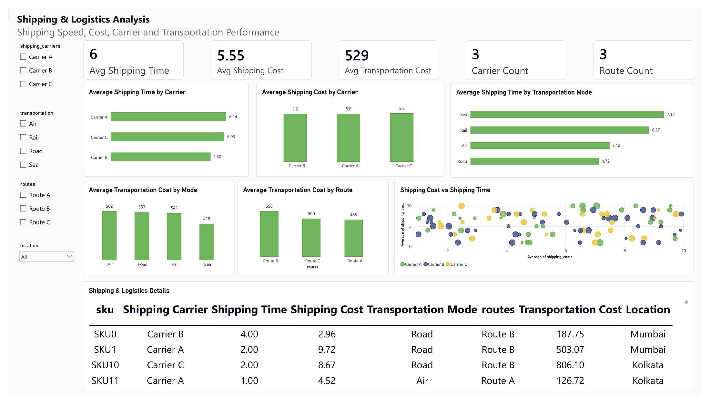

# Supply Chain Analysis Dashboard | Power BI

## Business value at a glance

**Decision:** Which SKUs and suppliers should operations teams review first?

- Analyzed **100 SKUs** across inventory, suppliers, manufacturing, and logistics.
- Flagged **21 potential stockout SKUs** and **25 potential overstock SKUs** using relative sales and stock benchmarks.
- Recommended prioritizing replenishment reviews and supplier follow-up; these are analytical recommendations, with no measured reduction in stockouts or costs claimed.

**Inspect the work:** [DAX logic](DAX_Measures.md) · [Findings and recommendations](PROJECT_INSIGHTS.md) · [Data definitions](DATA_DICTIONARY.md)

**Scope:** A snapshot without a date dimension. Risk flags are screening signals, not forecasts. Reported revenue describes the dataset, not revenue generated by this project.

A 6-page **Power BI supply chain analytics project** built to turn operational data into clear, decision-ready insights across sales, inventory, suppliers, manufacturing, and logistics.

<p align="center">
  
</p>

<p align="center">
  <a href="https://raw.githubusercontent.com/HussieniGamal/Supply-Chain-PowerBI-Analysis/main/Supply%20Chain%20Analysis.pbix">
    
  </a>
  <a href="DAX_Measures.md">
    
  </a>
  <a href="PROJECT_INSIGHTS.md">
    
  </a>
</p>

## 📦 Project Files

- **[Download Power BI Dashboard (.pbix)](https://raw.githubusercontent.com/HussieniGamal/Supply-Chain-PowerBI-Analysis/main/Supply%20Chain%20Analysis.pbix)**
- **[DAX Measures](DAX_Measures.md)**
- **[Project Insights](PROJECT_INSIGHTS.md)**
- **[Data Dictionary](DATA_DICTIONARY.md)**

## 📊 Project Snapshot

- **100 SKUs** analyzed
- **$577.6K** total revenue
- **46K** units sold
- **4,777** units in stock
- **21** potential stockout SKUs
- **25** potential overstock SKUs
- **5** suppliers evaluated
- **57K** total production volume

## 🎯 Business Questions

This dashboard was designed to answer practical questions such as:

- Which categories and SKUs drive the most revenue and sales?
- Which SKUs are at potential stockout or overstock risk?
- Which suppliers have the longest lead times or highest defect rates?
- Where are manufacturing cost, lead-time, and quality issues concentrated?
- Which carriers, transportation modes, and routes perform best on speed and cost?

## 📈 Dashboard Pages

### 1. Executive Overview
A high-level view of revenue, sales, stock, quality, and product performance.

<p align="center">
  
</p>

### 2. Sales Analysis
Tracks category, SKU, and customer-segment performance.

**Highlights**
- Skincare generated about **$241.6K** in revenue
- Skincare sold about **20.7K units**
- Top revenue SKU: **SKU51 (~$9.9K)**

<p align="center">
  
</p>

### 3. Inventory Analysis
Evaluates stock position against demand to identify potential inventory imbalance.

**Risk logic**
- **Potential Stockout:** sales above benchmark + stock below benchmark
- **Potential Overstock:** sales below benchmark + stock above benchmark
- **Healthy High Demand:** sales and stock above benchmark
- **Low Priority:** sales and stock below benchmarks

**Result**
- **21 potential stockout SKUs**
- **25 potential overstock SKUs**

<p align="center">
  
</p>

### 4. Supplier Analysis
Compares supplier performance across lead time, defects, inspections, and stock-risk exposure.

**Highlights**
- Supplier 3 has the longest average lead time: **20.13 days**
- Supplier 5 has the highest average defect rate: **2.67**
- Supplier 1 has the lowest average defect rate: **1.80**
- Supplier 1 is linked to the highest number of stock-risk SKUs: **7**

<p align="center">
  
</p>

### 5. Manufacturing Analysis
Monitors production volume, manufacturing cost, lead time, and quality.

**Highlights**
- Total production volume: **57K**
- Average manufacturing cost: **47**
- Average manufacturing lead time: **15 days**
- Failed inspections: **36**
- Average defect rate: **2.28**

<p align="center">
  
</p>

### 6. Shipping & Logistics Analysis
Compares carrier performance, transportation modes, route costs, shipping speed, and logistics cost.

**Highlights**
- Carrier B is the fastest carrier: **5.30 days**
- Road is the fastest transportation mode: **4.72 days**
- Sea is the slowest transportation mode: **7.12 days**
- Air has the highest average transportation cost: **562**
- Route B has the highest average route cost: **596**

<p align="center">
  
</p>

## 💡 Key Business Insights

### Inventory needs rebalancing
The combination of potential stockouts and overstocks suggests inventory is not optimally distributed across SKUs.

### Supplier risk is multi-dimensional
Supplier performance should not be judged using one KPI only. Lead time, quality, and inventory exposure tell different parts of the story.

### Skincare is the strongest commercial category
It leads the dataset in both revenue and units sold, so availability and production planning should protect this category.

### Logistics decisions require a speed-cost tradeoff
The fastest transportation option is not automatically the cheapest, so mode and route selection should be optimized together.

## ✅ Recommendations

- Prioritize replenishment for high-demand, low-stock SKUs.
- Review slow-moving, high-stock SKUs to reduce excess working capital.
- Set supplier targets for lead time, defect rate, and inspection performance.
- Review Supplier 3 for lead-time risk and Supplier 5 for quality risk.
- Investigate manufacturing processes with long lead times or high cost.
- Optimize transportation-mode and route selection using both speed and cost.
- Add historical demand data in a future version to support forecasting, reorder points, and safety stock.

## 🧮 DAX Highlights

The project uses DAX for:

- Revenue contribution and ranking
- Dynamic inventory benchmarks
- Potential stockout detection
- Potential overstock detection
- Inventory risk classification
- Supplier KPIs
- Manufacturing KPIs
- Shipping and logistics KPIs

See **[DAX_Measures.md](DAX_Measures.md)** for selected measures and explanations.

## 🛠️ Tools & Skills Demonstrated

`Power BI` `DAX` `Power Query` `Excel` `Data Modeling` `KPI Design` `Data Visualization` `Business Analysis` `Supply Chain Analytics`

## 📁 Repository Structure

```text
Supply-Chain-PowerBI-Analysis/
├── Supply Chain Analysis.pbix
├── README.md
├── DAX_Measures.md
├── PROJECT_INSIGHTS.md
├── DATA_DICTIONARY.md
└── assets/
    ├── 01_Executive_Overview.jpg
    ├── 02_Sales_Analysis.jpg
    ├── 03_Inventory_Analysis.jpg
    ├── 04_Supplier_Analysis.jpg
    ├── 05_Manufacturing_Analysis.jpg
    └── 06_Shipping_Logistics_Analysis.jpg
```

## ⚠️ Data Limitation

The dataset does not include a date dimension. Therefore, this version does not claim historical trends, seasonality, demand forecasting, or days-of-inventory analysis. Inventory risk is treated as a **relative analytical signal**, not a guaranteed future stockout event.

## 🚀 Future Improvements

- Add a proper Date table and historical demand data
- Build reorder-point and safety-stock logic
- Add ABC / XYZ inventory classification
- Add supplier scorecards
- Add demand forecasting
- Add drill-through pages for SKU-level root-cause analysis

---

### 👤 Author

**Hussieni Gamal**  
Data Analyst | Business Intelligence | Power BI | SQL | Python | Excel

[LinkedIn](https://www.linkedin.com/in/hussieni-gamal-549b68134/) • [GitHub Profile](https://github.com/HussieniGamal)

> The goal of this project is not only to visualize data, but to connect analysis with practical business decisions.
